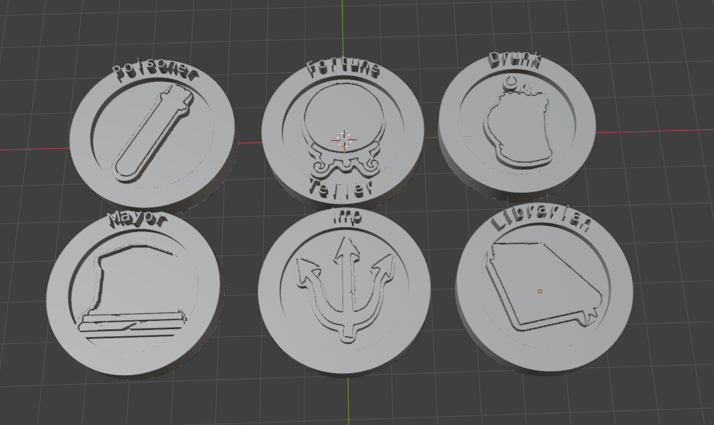

# BotC Token Generator

This program can generate STL files of "Blood on the Clocktower" Tokens.

## Process

Put the role images in the input_webp/ directory. You can download them from [script.bloodontheclocktower.com](https://script.bloodontheclocktower.com/).

Then you can run the `image-processor.py` to prepare the images for the generator. This script takes the image, filters it to a binary image (transparent background and white foreground) and crops it to the right size.

After running the preprocessor you can start the `main.py` script. This script may run longer depending on the amount of character tokens you are generating and the complexity of the image on the token.

## Output

The script outputs STL files in the output/ directory
